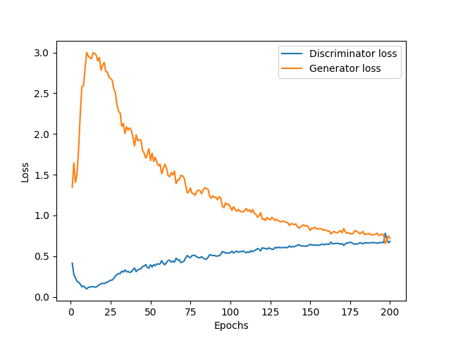

# Generative Adversarial Network (GAN) and its developments with pytorch
In this repository, GAN approach and its further developments are implemented and gathered together from different research papers. You can find a short description of each method, link to the related paper, the implemented code and the results in each section. In order to run each implementation, you can run the code, presented in each section separatly.

## Generative Adversarial Network GAN
### Description
In this method, a simultaneous training of a generetor (G) and a discriminator (D) via and adversarial process, allows the generator to find the distribution of the data while the discriminator tries to recognize the fake images from the real ones. The final propose of G is to maximize the probability of D making mistakes. Both the generator and discriminator networks contain linear and dense layers.
The loss function used in this method is BCE according to which G tends to maximize the loss function while the discriminator tries to minimize it i a two player game.   

### Reference
You can find the main approach in [Generative Adversarial Nets](https://arxiv.org/pdf/1406.2661.pdf).

### Run the code
you can run GAN method by:
```
python main.py --type GAN --epochs 200 --zdim 64 --lr 0.00001 --batch 128 --hidden_dim 128
```

### Results
 
<p float="left">
  
   
</p>
