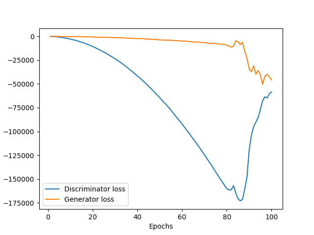

# Generative Adversarial Network (GAN) and Its Developments with Pytorch
In this repository, GAN approach and its further developments are implemented and gathered together from different research papers. You can find a short description of each method, link to the related paper, the implemented code and the results in each section. In order to run each implementation, you can run the code, presented in each section separatly. All the methods are applied to [MNIST](http://yann.lecun.com/exdb/mnist/) dataset right now, I will try to apply them on other datasets in the near future.

## Generative Adversarial Network (GAN)
### Description
In this method, a simultaneous training of a generetor (G) and a discriminator (D) via and adversarial process, allows the generator to find the distribution of the data while the discriminator tries to recognize the fake images from the real ones. The final propose of G is to maximize the probability of D making mistakes. Both the generator and discriminator networks contain linear and dense layers.
The loss function used in this method is BCE according to which G tends to maximize the loss function while the discriminator tries to minimize it i a two player game.   

### Reference
You can find the main approach in [Generative Adversarial Nets](https://arxiv.org/pdf/1406.2661.pdf).

### Run the code
Run GAN method with following settings:
```
python main.py --type GAN --epochs 200 --zdim 64 --lr 0.00001 --batch 128 --hidden_dim 128
```

### Results
<p align="center">
  
   
</p>


## Deep Convolutional Generative Adversarial Network (DCGAN)
### Description
This method is similar to GAN, however the main difference, compared to GAN, is that convolutional layers are used in both generator and discriminator networks instead of dense layers. The other parameters such as loss function are similar to GAN.

### Reference
You can find this method in [Unsupervised Representation Learning With Deep Convolutional Generative Adversarial Networks](https://arxiv.org/pdf/1511.06434.pdf).

### Run the code
Run DCGAN method, considering the appropriate settings, with the following command:
```
python main.py --type DCGAN --epochs 50 --zdim 64 --lr 0.0002 --batch 128 --hidden_dim 64
```

### Results
<p align="center">
  
   
</p>

## Wasserstein Generative Adversarial Network (WGAN)
### Description
This method is similar to DCGAN method, however, we use a Wasserstein loss function instead of BCE. W-loss generally approximates the Earth Mover's Distance between the real and generated distributions. The main difference between W-loss and BCE is that W-Loss doesn't have any logarithms within it, and that's because it's a measure of how far the prediction of the critic for the real is from its prediction on the fake. Meanwhile, BCE Loss does measure that distance between fake or a real, but to a ground truth of 1 or 0.


### Reference
You can find the main approach in [Wasserstein Generative Adversarial Network](https://arxiv.org/pdf/1701.07875.pdf).

### Run the code
Run WGAN method with following settings:
```
python main.py --type WGAN --epochs 100 --zdim 64 --lr 0.0002 --batch 128 --hidden_dim 64 --c_lambda 10 --critic_repeats 5
```

### Results
<p align="center">
  
  
</p>

## Wasserstein Generative Adversarial Network with Gradient Penalty (WGAN-GP)
### Description
This method is similar to WGAN, however, a penalty is added to the critic loss which is the gradient of a combination offake and real images. Using this gradient penalty in the loss function prevents the mode collaps phenomenon in the GAN networks and allows the GAN to reach better results faster.


### Reference
You can find the main approach in [Wasserstein Generative Adversarial Network with Gradient Penalty](https://arxiv.org/pdf/1704.00028.pdf).

### Run the code
Run WGAN-GP method with following settings:
```
python main.py --type WGAN_GP --epochs 100 --zdim 64 --lr 0.0002 --batch 128 --hidden_dim 64 --c_lambda 10 --critic_repeats 5
```

### Results
<p align="center">
  
  
</p>

## Spectrally Normalized Deep Convolutional GAN (SN-DCGAN)
### Description
This method is similar to DCGAN, however, SN_DCGAN normalizes the weight matrices in the discriminator by their corresponding spectral norm, which helps control the Lipschitz constant of the discriminator. In general, spectral normalization helps improve stability and avoid vanishing gradient problems, such as mode collapse. It is also good to know that you can use spectral normalization with any type of GAN methods and in this part it is used with DCGAN.


### Reference
You can find the main approach in [Spectral Normalization for Generative Adversarial Networks](https://arxiv.org/pdf/1802.05957.pdf).

### Run the code
Run SN-DCGAN method with following settings:
```
python main.py --type SN_DCGAN --epochs 50 --zdim 64 --lr 0.0002 --batch 128 --hidden_dim 64
```

### Results
<p align="center">
  
  
</p>
